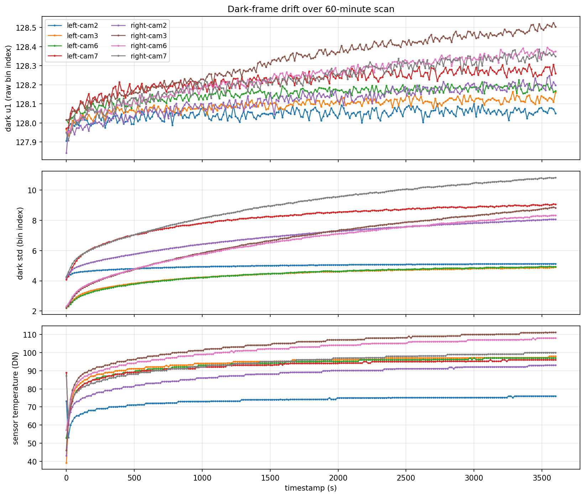
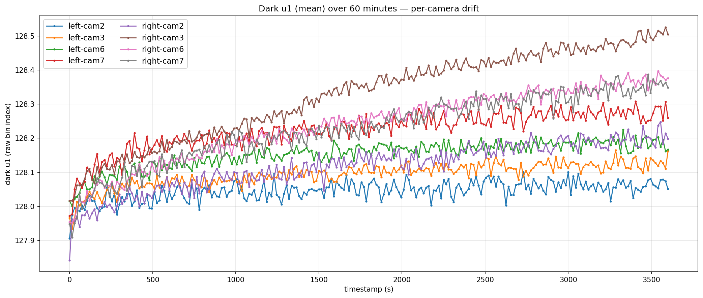
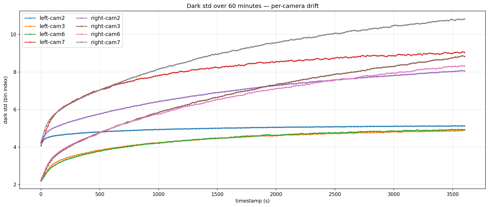
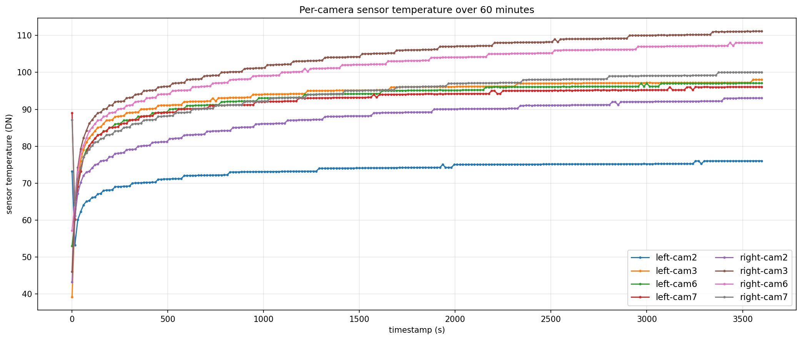
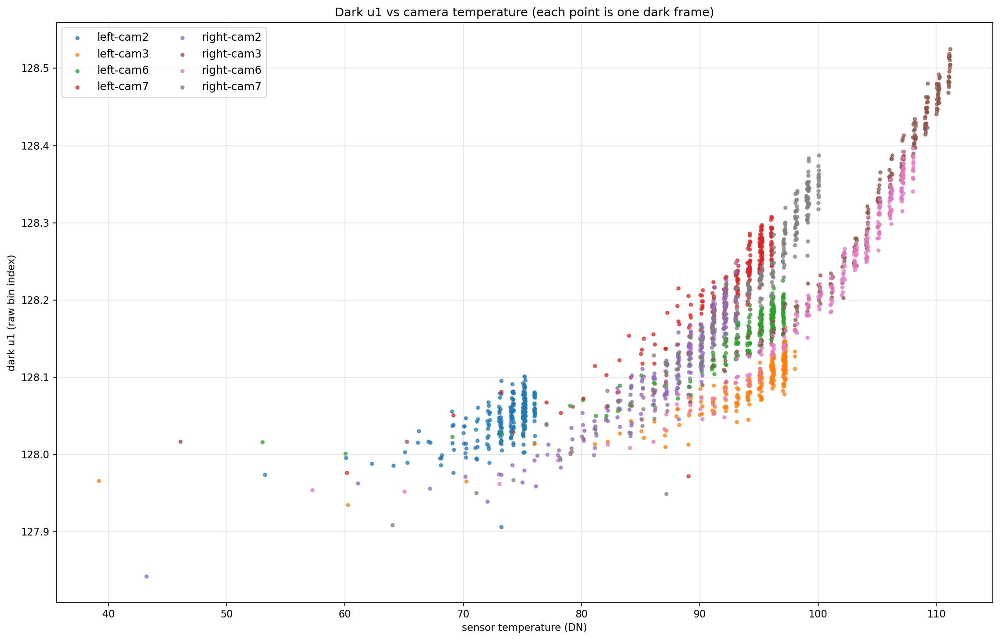
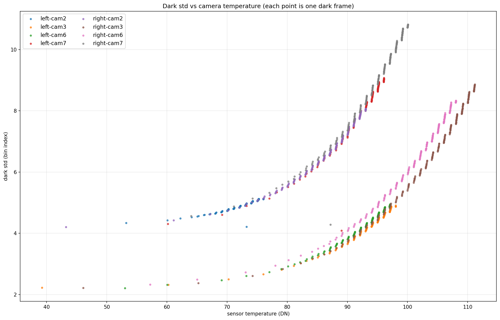
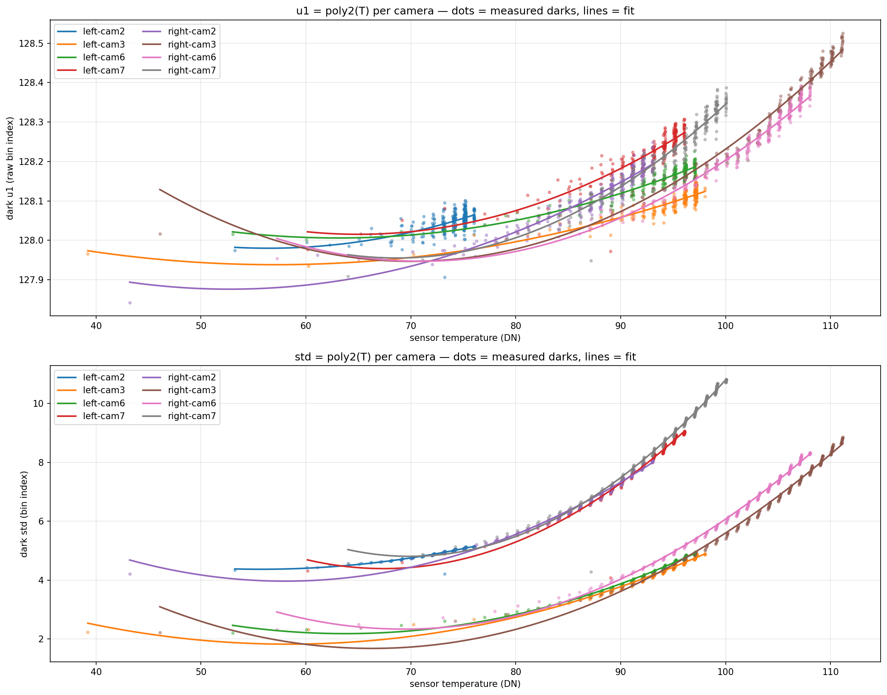
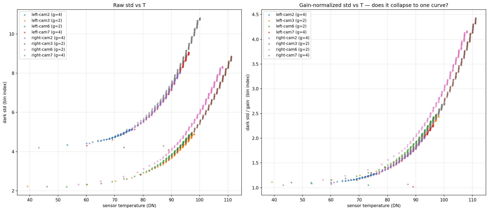

# Dark-frame drift study — Phase 1: physics characterisation

> **Status of recommendations in this document**: the "static per-camera
> `f(T)` calibration" architecture proposed at the end of this file was
> **superseded** by a no-calibration online estimator design in
> [`online_estimators.md`](online_estimators.md). The physics findings
> (drift magnitudes, temperature correlation, polynomial-fit residuals,
> gain-normalisation behaviour) are still load-bearing — the online
> estimator builds on them. The implementation plan that follows from
> all of this is in [`integration_proposal.md`](integration_proposal.md).

**Goal:** characterise how dark-frame mean (`u1`) and standard deviation (`std`)
drift during a long scan, and decide whether they can be estimated in real
time so the corrected BFI/BVI stream can be displayed live instead of only
emerging post-scan when the next dark frame closes an interpolation interval.

**TL;DR**

1. **`std` drift is the important signal.** Over a 60-minute scan, `std`
   grows by 2–7 bin indices (0.9 → 6.6×). Because `contrast = std / mean`,
   any error in the dark-corrected `std` propagates directly into BFI/BVI.
2. **`u1` drift is small but real** — 0.14–0.49 bin indices over the same
   hour, well above per-frame measurement noise.
3. **Sensor temperature is essentially the only driver.** `std` vs `T` is
   tight and monotonic (correlation **0.88–0.96** per camera) — no
   hysteresis, no time-residual.
4. **A per-camera quadratic `f(T)` fits both `u1(T)` and `std(T)` to within
   the per-frame measurement noise floor** (u1 RMSE ≤ 0.025 bin; std RMSE
   ≤ 0.21 bin).
5. **Camera gain (the firmware `[16, 4, 2, 1, 1, 2, 4, 16]` table) explains
   most of the camera-to-camera spread in `std`,** but not all of it —
   process variation and thermal-coupling effects leave residuals.
6. **Recommended estimator architecture:** per-camera quadratic
   `(u1, std) = f(T)` lookup, calibrated once. This enables real-time
   dark correction without waiting for two-dark intervals.

**Not yet verified:** cross-run reproducibility. A second scan starting from
a different temperature is the next required experiment.

---

## Background

Today's `SciencePipeline.on_corrected_batch_fn` only fires *after* two
consecutive dark frames have been observed for a camera (every 15 s under
the current `dark_interval = 600` schedule). It then linearly interpolates
the dark baseline across the interval and retroactively re-emits BFI/BVI
for every stored light frame in that interval. As a result:

* The bloodflow app's **live plots show uncorrected samples**, not the
  dark-corrected ones.
* The **saved CSV / DB sessions show corrected samples** because they're
  computed after the corresponding dark-interval batch has fired.

This is a meaningful UX gap during a scan. The goal of this study is to
determine whether the corrected pipeline can be moved live by *predicting*
the next dark frame's `u1` and `std` from data already in hand, rather
than waiting for it.

---

## Method

### Data

A 60-minute scan recorded at 40 fps, 4 active cameras per side
(mask `0x66` → 1-indexed cam2, cam3, cam6, cam7):

* `20260520_163109_owEENEJ6_left_mask66_raw.csv` — 1.6 GB
* `20260520_163109_owEENEJ6_right_mask66_raw.csv` — 1.7 GB

Per-frame columns: `cam_id, frame_id, timestamp_s, [1024 histogram bins], temperature, sum, tcm, tcl, pdc`.

### Pipeline (in `generate_plots.py` alongside this doc)

1. Stream each raw CSV row-by-row; reconstruct the firmware's
   absolute frame counter from its 8-bit wraparound (`raw_fid + 256 ×
   wrap_count`, per camera).
2. Filter to scheduled dark frames using the same rule as
   `SciencePipeline._is_dark_frame`: first dark at `discard_count + 1 = 10`,
   subsequent at `(abs_frame − 1) % dark_interval == 0`.
3. Compute the raw histogram moments per dark frame:
   * `u1 = sum(bin_index × count) / total_count`
   * `std = sqrt(sum(bin_index² × count) / total_count − u1²)`
4. Group by `(side, cam_id_1indexed)`. 8 streams × ~241 darks each →
   1,928 dark samples total.

### Camera gain reference

From `openmotion-sensor-fw/Core/Src/0X02C1B.c`:

| cam (1-idx) | 1   | 2 | 3 | 4 | 5 | 6 | 7 | 8   |
|---:|---:|---:|---:|---:|---:|---:|---:|---:|
| gain | 16  | 4 | 2 | 1 | 1 | 2 | 4 | 16  |

Active cameras in this scan (cam2, cam3, cam6, cam7) have gains
`[4, 2, 2, 4]` — two symmetric pairs.

---

## Findings

### 1. Drift of `u1`, `std`, and temperature over the 60-minute scan



All three signals show the same thermal-settling shape — fast initial
rise in the first ~500 s, then a slow asymptotic approach. Per-camera
spread is significant in `std` and temperature, smaller in `u1`.

### 2. Dark u1 (mean) — small but real drift



| camera | u1 start | u1 end | Δu1 (bin) | u1 std-dev across scan |
|---|---|---|---|---|
| left-cam2  | 127.91 | 128.05 | **+0.14** | 0.027 |
| left-cam3  | 127.97 | 128.16 | +0.20 | 0.034 |
| left-cam6  | 128.02 | 128.17 | +0.15 | 0.039 |
| left-cam7  | 127.97 | 128.26 | +0.29 | 0.056 |
| right-cam2 | 127.84 | 128.20 | +0.36 | 0.069 |
| right-cam3 | 128.02 | 128.50 | **+0.49** | 0.129 |
| right-cam5 | 127.95 | 128.38 | +0.42 | 0.103 |
| right-cam7 | 127.95 | 128.35 | +0.40 | 0.099 |

* All cameras drift **up**, monotonically.
* The right side drifts more than the left side at every position.
* **Sample-to-sample step (between consecutive dark frames, 15 s apart):
  std 0.018–0.029 bin indices.** Roughly 0.02 bin / 15 s on average.

Magnitude check: a light-frame `u1` is typically 500–1500 bin indices.
A 0.5-bin dark error propagates to ~0.05% on the corrected mean.
Small but not zero — and since `BVI = corrected_mean × calibration`,
it does shift the output.

### 3. Dark std — the dominant signal



| camera | std start | std end | Δstd (bin) |
|---|---|---|---|
| left-cam2  | 4.22 | 5.13 | +0.92 |
| left-cam3  | 2.23 | 4.91 | +2.68 |
| left-cam6  | 2.21 | 4.93 | +2.73 |
| left-cam7  | 4.08 | 9.05 | +4.96 |
| right-cam2 | 4.21 | 8.06 | +3.86 |
| right-cam3 | 2.21 | 8.83 | **+6.62** |
| right-cam6 | 2.32 | 8.33 | +6.00 |
| right-cam7 | 4.28 | 10.82 | +6.54 |

* All cameras drift up, monotonically, with the same thermal-settling
  shape as `u1`.
* **Magnitude is much larger:** 1× to 4× of the starting value. Because
  `contrast = std / mean`, a 4× std drift directly distorts BFI/BVI.
* Two clear groupings — high-gain (gain 4) cameras sit on a higher curve,
  low-gain (gain 2) on a lower one (see § 6).

### 4. Sensor temperature over the scan



* Cold-start range: 39 → 89 °C-DN (this firmware reports temperature in
  ADC counts; we haven't converted to engineering units for this study).
* End-of-scan range: 76 → 111.
* Curves track the `u1` / `std` shape exactly. This is the visual hint
  that drives the rest of the analysis.

### 5. Parametric `u1` vs `T` and `std` vs `T` — temperature drives it





* `std(T)` is **tight, monotonic, and per-camera deterministic** — no
  visible hysteresis between heating and cooling phases.
* `u1(T)` is also monotonic per camera; some scatter is the per-frame
  measurement noise on `u1`, which limits the signal-to-noise here
  (u1 only drifts 0.5 bin total).

Correlations per camera:

| camera | corr(u1, T) | corr(std, T) |
|---|---|---|
| left-cam2  | 0.59 | 0.92 |
| left-cam3  | 0.80 | 0.88 |
| left-cam6  | 0.87 | 0.93 |
| left-cam7  | 0.87 | 0.93 |
| right-cam2 | 0.91 | 0.93 |
| right-cam3 | 0.89 | 0.92 |
| right-cam6 | 0.93 | 0.95 |
| right-cam7 | 0.94 | **0.96** |

The weaker u1 correlations (left-cam2 at 0.59) are not a model deficiency —
they're a small-signal artifact (left-cam2 spans only 73→76 °C-DN, a
narrow range that's barely above the per-frame noise floor of `u1`).

### 6. Per-camera quadratic fit — `f(T)` captures the physics



Per-camera quadratic fits `y = c₀ + c₁·T + c₂·T²`:

| camera     | u1 RMSE  | std RMSE | T range covered |
|---:|---:|---:|---:|
| left-cam2  | 0.0216 | 0.0503 | 53–76  |
| left-cam3  | 0.0150 | 0.0719 | 39–98  |
| left-cam6  | 0.0151 | 0.0482 | 53–97  |
| left-cam7  | 0.0242 | 0.2089 | 60–96  |
| right-cam2 | 0.0219 | 0.1019 | 43–93  |
| right-cam3 | 0.0246 | 0.1498 | 46–111 |
| right-cam6 | 0.0171 | 0.0987 | 57–108 |
| right-cam7 | 0.0251 | 0.1848 | 64–100 |

* **u1 RMSE is 0.015–0.025 bin indices** — right at the per-frame
  measurement noise floor. We're fitting all the structure that's there.
* **std RMSE is 0.05–0.21 bin indices**, capturing ~98% of the variance
  per camera. The high-T tail on right-cam3 / right-cam7 shows mild
  cubic curvature the quadratic doesn't quite catch; a cubic would
  squeeze more residual but quadratic is already excellent.
* Coefficients are persisted in `calibration.json` next to this file
  for reuse.

### 7. Gain normalization — partial, not complete



If `std` scaled purely linearly with camera gain, dividing each curve
by its gain should collapse all 8 to one universal curve. It mostly
does:

* **At low T (cold start):** all `std / gain` values cluster in
  1.02–1.16 — essentially identical.
* **At high T:** `std / gain` spans 1.28–4.42, a 3.4× spread.
  Even cameras with the same gain (left-cam3 at 2.45 vs right-cam3 at
  4.42, both gain 2) don't fully agree.

The implied physics:

```
std² ≈ a² + (gain × b(T))²
```

with `a` = gain-independent read/quantization noise (~1 bin, dominates
at low T) and `gain × b(T)` = thermal noise amplified by gain
(dominates at high T). Within same-gain pairs, residual differences
are per-camera process variation and thermal-coupling effects.

For the estimator, this means:

* **Per-camera quadratics are already sufficient** for accurate
  prediction (RMSEs above). We don't *need* a universal model.
* Gain normalization is useful as a sanity check (we're seeing real
  physics) and as a starting point if we ever want a parameter-efficient
  shared model.

---

## Proposed estimator architecture

```
real-time light-frame correction:
    corrected_u1     = light_u1 − f_u1(T_light)
    corrected_std²   = light_std² − f_std(T_light)²
    corrected_contrast = corrected_std / max(corrected_u1, ε)
```

where `f_u1(T)` and `f_std(T)` are per-camera quadratics calibrated once.

**Why this works:**

* Temperature is read per-frame already (in the raw CSV today, available
  in the streaming pipeline as `Sample.temperature_c`).
* The polynomial evaluation is two multiplies and an add — negligible cost.
* No waiting for two dark frames means **corrected output is available
  from the first light frame onward**, modulo a brief warm-up while the
  first dark integrity check passes.
* Existing batched-interpolation corrected stream can be retained as
  a sanity check / ground truth.

**What we still need to verify before committing:**

1. **Cross-run reproducibility.** Does the same camera at the same `T`
   give the same `std` on a different scan? If yes, calibrate once and
   ship. If no, we need either (a) a per-scan offset estimated from
   the first 1–2 darks, or (b) a runtime adaptive correction on top of
   the static curve.
2. **Calibration scope.** Whether the calibration must be per-unit
   (each assembled head independently) or whether one set of
   coefficients per camera position holds across units. A small
   multi-unit study would settle this.
3. **Behavior past the calibration's T range.** Right-cam3 reached
   111 °C-DN here; the fit is only valid in the temperatures we observed.
   Extrapolation beyond requires either more data or a physically
   motivated functional form.

---

## Next steps

1. **Cold-start reproducibility scan.** Same config, different starting
   temperature (e.g. after the head has been off long enough to cool).
   Overlay against the existing `calibration.json` curves.
2. **Pick the estimator's online-vs-static character.** Depends entirely
   on the cross-run result.
3. **SDK integration.**
   * Plumb a "real-time dark correction" hook into `SciencePipeline`
     that consumes the calibration and produces corrected samples
     immediately for every light frame.
   * Keep the batched interpolation path for now — it can serve as the
     ground-truth comparison until the predictor is trusted.
4. **Decide whether u1 needs the same predictor.** Given its drift is
   small (≤0.5 bin), zero-order hold from the most recent dark may
   already be good enough; the `f_u1(T)` predictor is only ~2× better
   than ZOH. The complexity-vs-benefit may not be worth it for `u1`
   alone; `std` is where the win is.

## Reproducing this study

```bash
cd openmotion-sdk
python data-processing/dark-drift-study/generate_plots.py
```

This loads the two source CSVs (paths hard-coded at the top of the
script — edit if running elsewhere), regenerates every PNG in this
directory, and re-writes `calibration.json` with fresh quadratic
coefficients per camera. ~50 seconds per side on the source machine.
