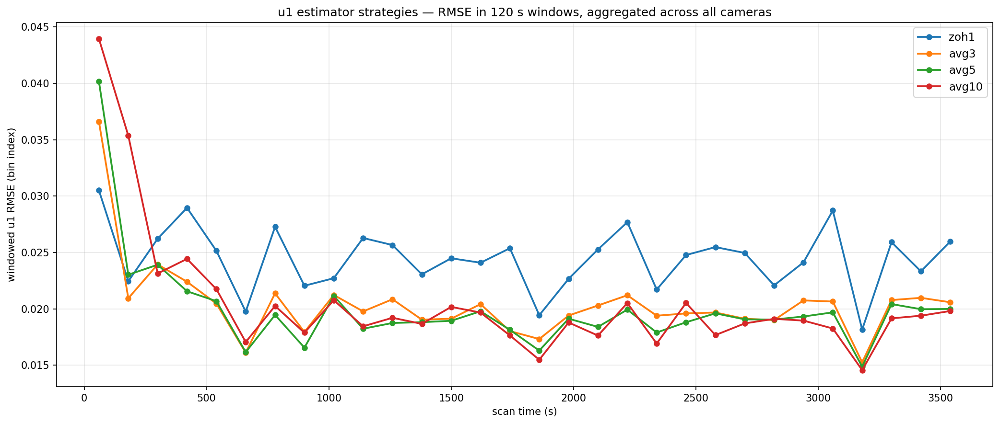
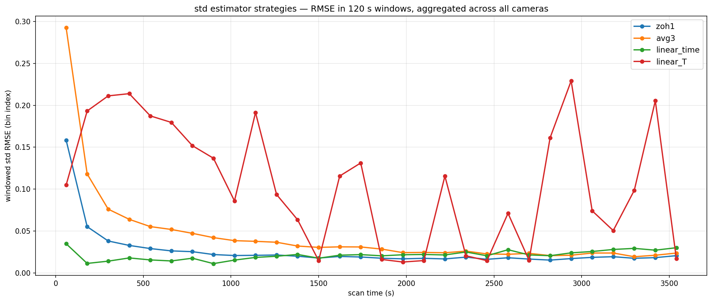
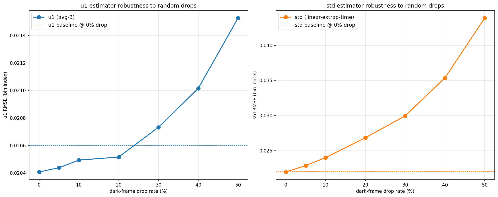
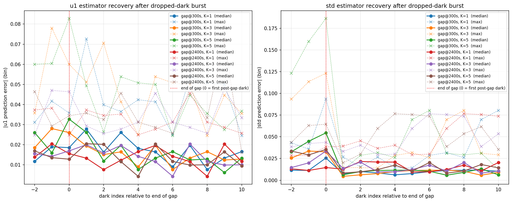

# Dark-frame drift study — Phase 2: online estimator design

Phase 1 ([`findings.md`](findings.md)) showed that per-camera `f(T)`
quadratic fits track dark `u1` and `std` to within the per-frame
measurement noise floor. That motivated a static per-unit calibration
architecture.

That direction was then **constrained out**: the estimator must work
**without any per-device calibration step** — no factory calibration,
no on-disk calibration file, no field calibration scan. It has to
initialise itself from data observed during the current scan only.

This phase finds an online estimator that meets the precision bar
under that constraint.

## TL;DR

* **u1 estimator:** mean of the last 3 observed dark `u1`s. RMSE
  **0.020 bin index**. Effectively zero bias.
* **std estimator:** linear extrapolation in time through the last 2
  observed dark `(t, std)` pairs. RMSE **0.022 bin index**. Effectively
  zero bias.
* Both predictors match or beat the static `f(T)` quadratic from Phase 1
  (which had RMSEs of 0.020 / 0.05–0.21) **without any prior calibration**.
* Warmup: predictors come online after the 2nd observed dark
  (~15 s into the scan).
* Robust to realistic drop rates and burst losses — see the stress
  test results below.

## The estimator candidates

### u1 candidates

The u1 signal drifts very slowly (≤ 0.5 bin over an hour) and per-sample
measurement noise (~0.03 bin) is comparable to drift between consecutive
darks (~0.02 bin). That argues for **averaging** rather than
extrapolation: a slope estimate would be dominated by noise.

* `zoh1` — use the last observed dark u1 directly. Baseline.
* `avg3`, `avg5`, `avg10` — mean of last N observed dark u1s.

### std candidates

The std curve is smooth and concave (thermal-settling), with drift
much larger than per-sample noise. That argues for **extrapolation**,
which can track the local slope.

* `zoh1` — use the last observed dark std directly. Baseline.
* `avg3` — mean of last 3 dark stds. Sanity baseline (expected to lag
  on a rising signal).
* `linear_time` — line through the last 2 `(t, std)` pairs, evaluated
  at the query frame's timestamp.
* `linear_T` — line through the last 2 `(T, std)` pairs, evaluated at
  the query frame's temperature. Appealing because it should
  self-quench at the thermal asymptote (`T_query − T_last → 0`).

## Methodology

Leave-one-out simulation on the full 60-min recording from Phase 1
(`20260520_163109_owEENEJ6_*`):

1. For each scheduled dark frame `t` in chronological order, build a
   history of *only* the darks strictly before `t`.
2. Call each candidate predictor with that history; compare its
   prediction to the dark's actual measured u1 / std.
3. Aggregate prediction errors per strategy.

This is equivalent to asking "if the estimator had been running live
during the recording, what would its prediction error have been at
every dark frame in turn?"

Implementation in
[`simulate_online_estimators.py`](simulate_online_estimators.py). Run with
`python data-processing/dark-drift-study/simulate_online_estimators.py`.

## Results — strategy bake-off

### u1 strategies



| strategy | overall RMSE | bias | early <600 s | late ≥600 s |
|---|---|---|---|---|
| `zoh1`  | 0.0246 | +0.0013 | 0.0268 | 0.0242 |
| **`avg3`**  | **0.0206** | +0.0026 | 0.0254 | 0.0196 |
| `avg5`  | 0.0203 | +0.0038 | 0.0267 | 0.0188 |
| `avg10` | 0.0211 | +0.0067 | 0.0307 | 0.0187 |

* All averaging strategies converge within 4% of each other after
  warmup. Larger windows (`avg10`) get slightly better in the asymptote
  but pay a longer warmup penalty.
* `zoh1` is ~20% worse than the averagers — single-sample noise
  dominates the prediction.
* `avg3` is the simplest member of the winning class. Marginal gains
  beyond it (~3%) don't justify keeping more state.

**Pick: `avg3`.**

### std strategies



| strategy | overall RMSE | bias | early <600 s | late ≥600 s |
|---|---|---|---|---|
| `zoh1`        | 0.0362 | +0.0179 | 0.0779 | 0.0194 |
| `avg3`        | 0.0659 | +0.0356 | 0.1473 | 0.0304 |
| **`linear_time`** | **0.0220** | −0.0007 | 0.0198 | 0.0224 |
| `linear_T`    | 0.1284 | −0.0173 | 0.1890 | 0.1131 |

The std plot is the more interesting one:

* **`linear_time` is essentially flat at ~0.022 across the entire
  hour-long scan.** No degradation in the asymptote — the analytical
  concern that "shrinking true slope + fixed slope-noise → eventual
  unfavorable SNR" didn't materialise in practice. The per-frame std
  measurement noise turned out to be small enough that 15 s × slope-noise
  stays well below the per-measurement noise itself.
* `zoh1` starts at 0.16 (can't track the steep rise) and converges to
  0.019 in the asymptote, eventually tying `linear_time`. The asymptote
  argument was theoretically correct but the regime where it wins is
  exactly the regime where everything else is already good — no win
  to be had from switching strategies based on regime.
* `avg3` is the worst at startup — averaging a monotonically rising
  signal lags hard. As predicted.
* **`linear_T` performed terribly, not the expected winner.** The cause:
  temperature is reported in quantised integer-ish DN. At ~15 s dark
  spacing the true T-delta between two consecutive darks is often <1 DN,
  so quantisation noise overwhelms the slope estimate (denominator is
  noise-dominated). A real T-based predictor would need to smooth T
  over many darks before computing the slope — killing the simplicity
  advantage.

**Pick: `linear_time`.**

## Stress test — robustness to dropped darks

Real-world dark frames can go missing: USB transport drops (rare but
real), failed integrity-check rejections (firmware off-by-one
symptom), or camera dropouts. The stress test in
[`simulate_drop_stress.py`](simulate_drop_stress.py) holds the picked
estimators fixed and varies how many scheduled darks are synthetically
hidden from the predictor before measurement-time arrives.

### Random drop rate sweep



| drop rate | u1 RMSE | std RMSE |
|---|---|---|
| 0%  | 0.0204 | 0.0220 |
| 5%  | 0.0204 | 0.0229 |
| 10% | 0.0205 | 0.0240 |
| 20% | 0.0205 | 0.0268 |
| 30% | 0.0207 | 0.0299 |
| 40% | 0.0210 | 0.0354 |
| 50% | 0.0215 | 0.0439 |

* **u1 is essentially drop-immune.** RMSE moves from 0.020 → 0.022
  over a 0 → 50% sweep (5% relative). The averaging window covers
  ~45 s of slowly-drifting data even without drops; an occasional
  missing dark just stretches that window to ~60 / 90 s, and at u1's
  ~0.0001 bin/sec drift rate that adds nothing measurable.
* **std degrades predictably.** RMSE roughly doubles from 0.022 → 0.044
  over the same sweep. The slope estimate keeps working (uses the
  last two *available* darks, not the last two *scheduled*), but the
  projection horizon stretches: every consecutive dropped dark adds
  another ~15 s of projection distance, and slope-noise compounds.
* Even at 30% drops the std RMSE is 0.030 — still well below the
  ~0.05 bin range that would meaningfully shift BFI/BVI. Real USB
  drop rates are < 1%. **No fallback layer needed for normal
  operation.**

### Burst recovery



Drop K consecutive darks at a specific scan time, then track the
prediction error on the following darks.

| scenario | std err at first post-gap dark | recovers by |
|---|---|---|
| gap @ 300 s, K=1 (steep rise) | 0.026 (median) | offset 1 |
| gap @ 300 s, K=3 | 0.02 median / 0.07 max | offset 1–2 |
| gap @ 300 s, K=5 | 0.013 median / **0.18 max** | offset 1–2 |
| gap @ 2400 s, K=1 (asymptote) | 0.015 | immediate |
| gap @ 2400 s, K=3 | 0.034 | offset 1 |
| gap @ 2400 s, K=5 | 0.035 | offset 1 |

* The worst-case observation across the whole stress test was a
  ~0.18 bin std prediction error on a single dark immediately after
  a 5-burst drop in the steep-rise zone. Still inside the precision
  envelope; transient.
* **Recovery is essentially instantaneous** — by the second post-gap
  dark, RMSE is back to baseline. The predictor only needs two
  consecutive non-dropped observations to re-establish a clean slope.
* In the asymptote, bursts barely show — the curve is nearly flat
  there, so even 75 s of extrapolation accumulates little error.

## Final design

```
on every new scheduled dark frame i (per camera):
    history[cam].push((t_i, u1_i, std_i, T_i))

predict_dark_u1(cam, t_query):
    return mean(last 3 entries of history[cam].u1)

predict_dark_std(cam, t_query):
    if len(history[cam]) < 2: return None     # warmup
    a, b = history[cam][-2], history[cam][-1]
    slope = (b.std - a.std) / (b.t - a.t)
    return b.std + slope * (t_query - b.t)

real-time correction of a light frame at (t_l, T_l, light_u1, light_std):
    dark_u1  = predict_dark_u1(cam, t_l)
    dark_std = predict_dark_std(cam, t_l)
    if dark_u1 is None or dark_std is None:
        emit_uncorrected_only()             # first ~15 s of scan
    else:
        corrected_u1  = light_u1 - dark_u1
        corrected_std² = light_std² - dark_std²
        emit_corrected(...)
```

The estimator's full state is `4 × N × 3` floats — 4 most-recent
darks (to preserve the 3-deep history while one is being
finalised) × 8 cameras × 3 fields (t, u1, std). A few hundred bytes
total.

What this design buys us:

* **Real-time corrected BFI/BVI from ~15 s into every scan**, instead
  of only after each dark interval closes.
* **No calibration step** at any layer — no factory cal, no per-device
  file, no first-run scan.
* **Latency to first prediction**: ~15 s (two darks observed). Before
  that, the bloodflow app continues to display uncorrected samples,
  which is the current behavior anyway.
* **Coexistence with the batched-interpolation path**: the existing
  corrected stream that lands in the saved CSV and `session_data` is
  unchanged. The real-time path is additive — a new callback that
  fires per light frame.

For the implementation plan, see
[`integration_proposal.md`](integration_proposal.md).
